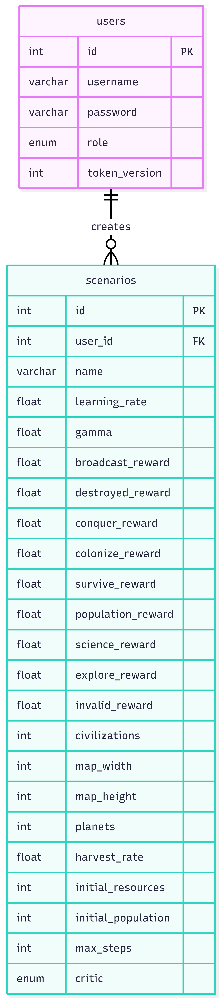

# Database Schema Documentation

## Diagram Overview
The diagram illustrates a relational database schema designed for the assessment project. It consists of two primary tables: `users` and `scenarios`. The architecture defines a one-to-many relationship where a single user can create and own multiple simulation scenarios, enforced by a foreign key constraint.

## Tables and Variables Dictionary

### `users` Table
Handles system authentication, authorization, and session invalidation.

* **id** (int): Primary Key. Unique auto-incremented identifier for the user.
* **username** (varchar): The user's unique login name.
* **password** (varchar): The securely hashed password string.
* **role** (enum): Defines the access control level. Allowed values are 'admin' or 'user'.
* **token_version** (int): A counter used to manage JWT invalidation on logout.

### `scenarios` Table
Stores the hyperparameters, map configurations, and reward structures for the multi-agent reinforcement learning simulations.

* **id** (int): Primary Key. Unique auto-incremented identifier for the scenario.
* **user_id** (int): Foreign Key. References `id` in the `users` table to establish ownership.
* **name** (varchar): The display name assigned to the scenario.
* **learning_rate** (float): The step size used by the reinforcement learning optimizer.
* **gamma** (float): The discount factor determining the importance of future rewards.
* **broadcast_reward** (float): Reward value for successfully establishing communication.
* **destroyed_reward** (float): Penalty value assigned when an agent or asset is destroyed.
* **conquer_reward** (float): Reward value for taking control of an enemy node.
* **colonize_reward** (float): Reward value for establishing a presence on a neutral node.
* **survive_reward** (float): Incremental reward granted per step survived.
* **population_reward** (float): Reward multiplier tied to population growth metrics.
* **science_reward** (float): Reward for technological or research advancements.
* **explore_reward** (float): Reward for discovering unexplored areas of the map.
* **invalid_reward** (float): Penalty for attempting actions outside the permissible action space.
* **civilizations** (int): The total number of independent agent factions in the simulation.
* **map_width** (int): The horizontal dimension of the simulation grid.
* **map_height** (int): The vertical dimension of the simulation grid.
* **planets** (int): The number of habitable or interactable nodes generated in the map.
* **harvest_rate** (float): The resource extraction multiplier per step.
* **initial_resources** (int): The starting resource pool for each civilization.
* **initial_population** (int): The starting agent count for each civilization.
* **max_steps** (int): The absolute limit of steps before an episode terminates.
* **critic** (enum): The specific reinforcement learning algorithm architecture designated for the scenario. Allowed values are 'IPPO' or 'MAPPO'.